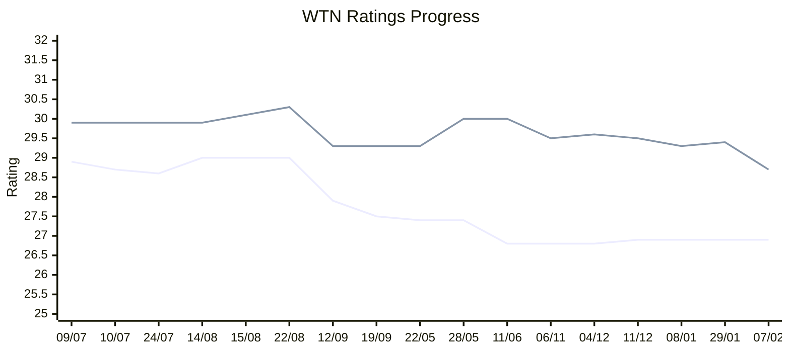

# 🎾 WTN

Tracking my singles and doubles [WTN](https://worldtennisnumber.com) (World Tennis Number) over time by scraping my [LTA profile](https://competitions.lta.org.uk/player-profile/d6a6f490-b524-4ddd-bd28-31d6559ff120).

## Current

* **Singles**: 26.9
* **Doubles**: 28.7

## Progress

## History

Available in: [data/ratings.csv](data/ratings.csv)

## Development

### Setup

Install [Poetry](https://python-poetry.org/) for managing Python dependencies.

    make setup && make install

### Running

Run script to fetch ratings and write them to [data/ratings.csv](data/ratings.csv) if they have changed.

    make run